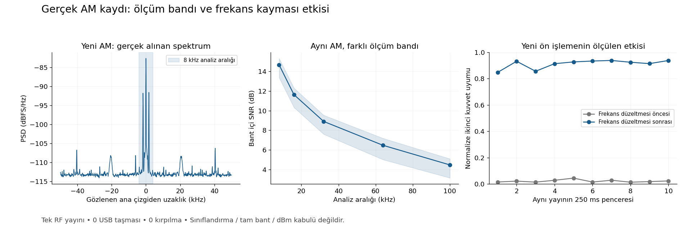

# Dört zorunlu teknik parametrenin durumu ve uygulama kararı

Kapsam yarışma §5.1.2, KTR-4.2 / KTR-4.2-F1 ve mevcut PÇ-02/03 çalışmasıdır.
İnceleme tarihi 9 Eylül 2026'dır. Kullanılabilir donanım, son beyana göre yalnız
iki HackRF'dir. Önceki kayıtlardaki osiloskop/60 MHz üreteç erişimi güncel
çalışmanın varsayımı değildir.

Dört alanın yazılımı bulunmasına rağmen, dördünün birlikte gerçek RF'de doğru
çalıştığı henüz gösterilememiştir. İlerlemeyi engelleyen tek konu kalibrasyon
değildir: ölçüm bandı, zayıf RF bağlantısı, sınıflandırıcının gerçek veriye
genellemesi ve ürün/kart entegrasyonu ayrı eksiklerdir. Yeni sentetik başarı
oranları üretmek bu eksikleri kapatmaz.

## Son fiziksel kayıt ve uygulanan ön işleme

Yeni AM koşusunda operatör Play teyidi verdi. 30 saniyelik alıcı kaydı
480.000.000 bayt, sıfır USB taşması ve sıfır kırpılmayla tamamlandı. Kayıtta
13,75–19,70 saniye arasında yaklaşık altı saniyelik tek yayın bölümü ve
1699,21875 Hz zarf tonu bulundu. Ana çizgi yaklaşık 824,989697 MHz'dir;
bu gözlem bağımsız kalibre taşıyıcı frekansı değildir.

8 kHz tanı aralığında medyan SNR 14,67 dB, medyan güç −58,91 dBFS ve
koşullu aralık içi bant 3,694 kHz'dir. Aynı kaydın 64 kHz aralığında bant
yaklaşık 41,7 kHz'ye çıkar; yan içerik sahipliği açıklanmadan dar sonuç
tam emisyon OBW'si sayılamaz. Dondurulmuş v9 adayında 8 ve 16 kHz için
10/10 kalite kapısı geçti, 10/10 sınıf Belirsiz kaldı. 32/64 kHz tanısında
bir/iki Analog sonuç alınması, en iyi aralığı seçerek kabul yapılmasına
gerekçe değildir. Bu kayıt AM'deki sorunun yalnız düşük bağlantı seviyesi
olmadığını doğrular. Kanıt:
[AM bağlantı koşusu](../../results/evidence/phase08/parameter-am-linkcheck-20260909.json).

Yeni BPSK alıcı kaydı da tam boyutta, taşmasız ve kırpılmasızdır; ancak
seçilen çizgi etkinliği yönteminde hedef yayın bölümü bulunmamıştır.
Play basışıyla kayıt süresinin kesin eşleşmesi bilinmez. Bu koşu RF kaynağı
başarısızlığı, kalibre RF yokluğu veya BPSK sınıflandırma başarısızlığı
değildir; kayıt/başlatma eşzamanlama sorunu olarak korunur.
[BPSK bağlantı penceresi](../../results/evidence/phase08/parameter-bpsk-linkcheck-20260909.json).

`algorithms/parameters/rf_observation.py` yeni ürün dışı ön işlemedir:
50–500 ms I/Q, Welch güç hesabı, sınıf kalitesinden bağımsız bant gücü,
frekansa kaydırma, çok fazlı örnek azaltma, FIR kanal süzme ve filtre uçlarının
çıkarılması uygulanmıştır. İkinci/dördüncü kuvvet çizgilerinden frekans
hipotezleri üretilir; hipotez doğrulanmış taşıyıcı veya sınıf diye sunulmaz.
M'inci kuvvet yönteminin frekans aralığı ve modülasyon uygulanabilirliği
sınırlıdır; bu yaklaşımın resmî algoritma açıklaması [7]'dedir.

Yeni AM kaydının on 250 ms penceresinde normalize ikinci kuvvet uyumu,
frekans düzeltmesi öncesi 0,0129–0,0439, sonrası 0,8477–0,9386 bulunmuştur.
Önceki AM kaydında da düzeltme sonrası 0,8312–0,9047 ölçülmüştür. Bu,
özellikteki frekans duyarlılığının doğrudan gözlemidir; önceki modelin bütün
hatalarının tek kök nedenini kanıtlamaz. NFM'nin on penceresi düşük SNR
nedeniyle özellik üretmez. Taşmalı eski BPSK kaydında yalnız bir pencere
kaliteyi geçer; kabul paydasına alınmaz.

Dört gerçek RF kaydından 40 yayın ve dört yayın öncesi pencere işlenmiştir.
Aynı gerçek I/Q üzerinde güç ölçeği/frekans bağlamı kontrolleri, alıcı DC
aralığı reddi ve düşük SNR'nin güç alanını silmemesi doğrulanmıştır.
Kalibre taşıyıcı, tam OBW, kesin Analog/Sayısal kararı ve dBm açık kalır.
F5 ürünü, eşikleri, RTL ve ARM ikilisi değiştirilmemiştir. Bu PC adayı
için gerçek zaman/ARM bellek ve süre kabulü yoktur.
[Ön işleme kanıtı](../../results/evidence/phase08/rf-observation-records-20260909.json).



[Grafiğin kaynak ölçüleri](../../outputs/01a086c7-4d85-7932-8318-dbf56e51c09d/Gerçek_RF_Ölçümleri.xlsx)
aynı gerçek kaydın spektrumunu, bant/SNR özetini ve on pencerenin frekans
düzeltmesi öncesi/sonrası değerlerini içerir. Sayılar ölçüm çıktısıdır;
tablo yeni bir başarı puanı veya kalibrasyon oluşturmaz.

## Mevcut durum

| İstenen alan | Mevcut uygulama | Gerçek kanıt ve eksik | Aşama |
|---|---|---|---|
| Taşıyıcı frekansı | PC/F5'te taşıyıcı çizgisi; ayrı v9 adayında çizgi ve spektral merkez | Temiz CW kaydında yaklaşık 824,989819 MHz gözlendi. 825 MHz verici ayarı mutlak frekans referansı değildir. Modülasyon yan çizgisini taşıyıcıdan ayırma ve farklı bantlarda doğrulama açık. | Kısmen uygulanmış; fiziksel doğruluk kabulü açık |
| Bant genişliği | PC/F5 ve ARM'da OBW99 sayısal hesabı; ayrı v9 adayında dış enerji kontrolü | Aralık dışı enerji ve düşük SNR kuyruk ölçümünü etkiliyor. AM'de yalnız ana bileşenlerle daha geniş spektral içeriğin bantları farklı. | Kısmen uygulanmış; tam emisyon RF kabulü açık |
| Güç seviyesi | PC/F5 ve ARM'da gürültüsü çıkarılmış bant gücü, dBFS ve SNR | Sayısal ölçek mevcut. RF girişindeki mutlak dBm karşılığı kalibre değil. Aynı düzen/kazançta göreli seviye ölçümü yapılabilir. | Göreli ölçüm var; mutlak güç doğrulaması yok |
| Analog/Sayısal ayrımı | PC/F5'te sınırlı yöntem; ürün dışındaki v6 ağaç modeli/v9 ön işleme adayı | Son Replay AM, NFM ve BPSK koşularında adayın onar penceresi Belirsiz. AM'de dar aralık kaliteyi iyileştirse de eski modelin 0,90 karar eşiği geçilmedi. | Gerçek kullanım için çözülmemiş |

Bu alanların hiçbiri için genel yarışma kabulü ilan edilmez. F5'in geçmiş
sayısal kabulü, yeni adayın veya yeni RF koşusunun başarısı değildir.
Temel sözleşmeler: [parametre çıktıları](../interfaces/PARAMETER_EXTRACTION_CONTRACT.md),
[operatör destekli ölçüm](../interfaces/OPERATOR_ASSISTED_PARAMETER_CONTRACT.md),
[güncel mimari](../architecture/P0_SYSTEM_ARCHITECTURE.md).

## Gerçek kayıtların yeniden incelenmesi

Yeni `scripts/analyze_parameter_rf_readiness.py` yalnız kayıtlı gerçek I/Q
okur. AM, NFM ve BPSK'nin üç ayrı ham kaydı ile üç kayıt manifestinin SHA-256
özetleri mevcut kanıt listeleriyle karşılaştırılmıştır. Her kayıtta önceden
gözlenmiş yayın bölümünden on adet 250 ms pencere, ayrıca önce ve sonra birer
pencere işlenmiştir. Otuz yayın penceresi otuz bağımsız RF koşusu değildir.
BPSK'nin taşmalı kaydı yalnız tanı olarak tutulmuştur.

8 MS/s ham örneklerde 65536 noktalı Hann/Welch kullanılır; FFT frekans adımı
122,0703 Hz, pencere eşdeğer gürültü bant genişliği yaklaşık 183,1055 Hz'dir.
250 ms'deki 60 örtüşen periodogram ortalanır. Bunlar bağımsız 60 ölçüm
değildir ve ortalama almak frekans adımını küçültmez. Welch'in PSD yoğunluğu
ölçeklemesi kullanılır; güç için lineer PSD integrali alınır. [1]

Bütün ailelerde aynı 8/16/32/64/100 kHz aralıkları raporlanır. Her aralığın
iki yanında 10 kHz koruma ve 20 kHz referans vardır. Ortalama referans PSD'si
çıkarılır; negatif hücreler güç toplamından önce sıfırlanmaz. Aralık içi
koşullu bant tanısında toplam gücü koruyan mevcut simplex izdüşümü kullanılır.
Bu araç bir otomatik bant seçicisi veya yeni sınıflandırıcı değildir.

| Kayıt | 8 kHz aralıkta medyan SNR | 32 kHz aralıkta medyan SNR | 100 kHz aralıkta medyan SNR | USB |
|---|---:|---:|---:|---|
| AM | 12,06 dB | 6,66 dB | 1,86 dB | Taşma yok |
| NFM | 4,80 dB* | −1,38 dB | −10,47 dB | Taşma yok |
| BPSK | 5,80 dB* | 2,84 dB | −2,10 dB | 1 taşma; kabul dışı |

* 8 kHz, NFM ve BPSK kaynak dosyalarının yaklaşık 17 ve 21,5 kHz OBW'sinden
dardır. Bu iki yüksek görünen sonuç tam sinyal SNR'si veya geçerli bant ölçümü
olarak seçilemez. Dosya bantları da RF çıkışının kalibre bantları değildir.

AM ana bileşenleri için 8 kHz aralıkta sinyal gücü medyanı −60,31 dBFS,
koşullu aralık içi OBW medyanı 3,641 kHz bulunmuştur. Aynı kayıtta 64 kHz
aralığa geçildiğinde koşullu OBW yaklaşık 42,0 kHz olur. İlgili spektrumda
ana sinyal dışındaki çizgilerin yayıcıya mı, alıcıya mı yoksa başka bir
bileşene mi ait olduğu gösterilmemiştir. Dar sonucu dosyadaki 3,417 kHz'e
yakın diye seçmek, tam RF bant doğruluğunu kanıtlamaz.

NFM'de 32 kHz aralığın on pencere SNR aralığı −5,48…+0,36 dB, BPSK'de
2,04…5,77 dB'dir. Bu sonuçlar önceki düşük SNR retlerinin yalnız kısa FFT
rastlantısıyla açıklanamayacağını destekler. Gürültü referansı da yayın
öncesi değeriyle birebir aynı değildir; dolayısıyla önceki kapalı spektrumu
çıkarıp tüm farkı sinyal gücü saymak güvenilir bir kestirme değildir.

Yeni hesap ve önceki v9 farklı pencere/referans yöntemleridir; SNR sayıları
aynı kestirimcinin öncesi/sonrası performans sonucu olarak karşılaştırılmaz.
Kalibre SNR doğruluğu, komşu enerji sahipliği ve tam OBW hâlâ açıktır.
36 gerçek pencerenin PSD integrali ile pencere ağırlıklı zaman alanı enerjisi
arasındaki en büyük göreli fark 3,56×10⁻¹⁵'in altındadır. Bu normalizasyon
kontrolüdür; RF doğruluğu değildir.

Kanıt: [yeni RF tanı özeti](../../results/evidence/phase08/parameter-rf-readiness-20260909.json).
Özgün geçmiş sonuçlar:
[AM](../../results/evidence/phase08/replay-amg8-evaluation-20260909.json),
[NFM](../../results/evidence/phase08/replay-nfmg8-evaluation-20260909.json),
[BPSK](../../results/evidence/phase08/replay-bpskg8-diagnostic-20260909.json).

## Ölçüm yöntemine ilişkin kararlar

### Taşıyıcı frekansı

Spektral merkez, taşıyıcı çizgisi ve nominal ayar farklı alanlar olarak
kalmalıdır. CW ve taşıyıcılı AM'de güçlü çizginin dar spektral tepesinden
alt hücre kestirimi yapılabilir. FM'in güçlü yan çizgisi, BPSK/QPSK'nin
güç merkezi veya frekans eksenindeki en yüksek hücre genel bir taşıyıcı
kanıtı değildir. Bastırılmış taşıyıcılı ailelerde uygun frekans kayması
kestirimi ayrı yöntem ve uygulanabilirlik durumu gerektirir.

Öncelik, mevcut çizgi hesabının olayla aynı I/Q'ya bağlanması ve uzun
gözlemde kararlılığının ölçülmesidir. Tek bir gözlemden tüm bantlar için
kalibrasyon katsayısı çıkarılmaz. İki HackRF'nin farkı, iki cihazın birleşik
frekans hatasını içerir; tek başına hangisinin doğru olduğunu göstermez.
HackRF One ortak 10 MHz saat kullanımını destekler. Ortak saat göreli
kaymayı azaltabilir; doğruluğu bilinmeyen bir saat mutlak referans olmaz. [2]

### Bant genişliği

Hedef tanım %99 işgal edilen banttır: toplam emisyon gücünün her uçta
%0,5'i dışarıda kalır. ITU-R SM.443-4; aralık, çözünürlük, gürültü ve
girişimin bant sonucuna etkisini açıkça ele alır. Belgedeki doğrudan ölçüm
koşullarında yüksek dinamik aralık istenir. Bu koşullar, burada kullanılan
12 dB geliştirme bağlantısı hedefiyle eşdeğer değildir. [3]

Gerekli değişiklik, aralık seçimini sınıflandırıcı oyuna göre ayarlamak
değil, spektral içerik ve dış kuyruk belirsizliği üzerinden belirlemektir.
250 ms ortalamalı spektrum bu tanıyı artık mümkün kılar. Ürün hâlâ dört
4096 örnekli kareyi kullanır; yeni süre ürün akışına eklenmiş değildir.
Aralık büyüyünce yeni emisyon bileşeni veya girişim geliyorsa önce sahiplik
çözülür. Tam emisyon sığmıyorsa aralık içi ölçüm tam OBW adıyla gösterilmez.

### Güç seviyesi

Ölçülecek büyüklük, alıcı girişinde görülen kanal gücüdür. Uzaktaki
vericinin çıkış gücü; anten, yol kaybı ve yön bilgisi olmadan bu sayıdan
çıkarılamaz. Mevcut sayısal referansta 0 dBFS, normalize kompleks I/Q için
ortalama |I+jQ|²=1 değeridir. Pencere enerji düzeltmesi ve örnek ölçeği bir
kez uygulanır. SNR'nin gürültü gücü, belirtilen ölçüm bandına aittir.

İki HackRF ile sabit frekans, kazanç, filtre ve yerleşimde göreli güç
değişimleri ölçülebilir. TX menüsündeki kazanç değeri RF çıkışındaki dBm
değeri değildir. HackRF belgeleri kazanç basamaklarının farklı aşamalarda
olduğunu ve aşırı kazancın bozulmaya veya gürültü artışına yol açabileceğini
belirtir. Bu nedenle RX kazancını sürekli artırmak çözüm sayılmaz. [4]

Mutlak dBm alanı bağımsız referans bulunana kadar kapalı kalır. Bu eksik,
frekans/bant/sınıflandırma geliştirmesini durdurmaz. Paylaşılan §5.1.2
metninde güç birimi ve toleransı belirtilmediğinden dBFS'nin yarışma kabulü
için yeterli olduğu da varsayılmaz. Gerekirse organizasyondan istenecek
teknik açıklama: “Güç seviyesi için referans düzlemi, birim ve izin verilen
hata nedir; göreli ölçüm kabul edilir mi?”

### Analog/Sayısal ayrımı

Mevcut v6 model, 0,90 toplam ağaç oy eşiği kullanır. Bu skor kalibre
doğruluk olasılığı değildir. Sayısal geliştirme örneklerinin başarılı olması
gerçek cihaz bozulmalarındaki başarıyı sağlamamıştır. Önceki dar aralık AM
tanısında kalite kapısı geçmesine rağmen Analog skoru yaklaşık 0,64–0,83
aralığında kaldığı için yalnız sinyali güçlendirmek de bu açığı kapatmış
sayılmaz.

Gerçek RF üzerinde yayımlanan sınıflandırma araştırmaları; frekans kayması,
sembol hızı ve kanal etkilerini ayrı inceler. O'Shea ve çalışma arkadaşlarının
araştırmasında sentetik eğitimden gerçek RF'ye geçişte başarı kaybı ve RF
verisiyle uyarlamanın etkisi ölçülmüştür. Bu bulgu burada aynı başarı
yüzdesinin elde edileceği anlamına gelmez; aynı kayıtlarla sürekli test
yerine gerçek geliştirme ve bağımsız değerlendirme verisi ayrımını
destekler. [5]

Uygulama yönü: kesintisiz FIR kanal süzme ve uygun örnek azaltma, frekans
kaymasının giderilmesi, bant/gözlem süresine uygun zarf ve faz özellikleri,
yüksek dereceli momentler ve sembol düzeni kanıtlarının birlikte kullanımı.
AM/FM ile sayısal aileler için açıklanabilir başlangıç tercih edilir;
büyük sinir ağı tek başına çözüm olarak seçilmez. CW, belirsiz aileler,
çoklu yayın ve düşük kaliteli ölçümler Belirsiz kalabilir. Bunlar yeni
ürün özellikleri değil, sıradaki yöntem geliştirmesinin sınırlarıdır.

## İki HackRF ile uygulanabilir devam

1. **Ölçüm bağlantısı:** mevcut onaylı Faraday kabininde yerleşim ve alıcı
   ayarları sabitlenir. Alıcı USB'de sonu 35138247 olan cihaz olarak yeniden
   görüldü; v2.4.0 bildiriyor. Verici tek sonlu Replay dosyasıyla operatör
   tarafından başlatılır. Kalıcı TX veya otomatik yayın başlatma eklenmez.
2. **Seviye ayarı:** tek kısa yayınla hedef bant gücü, gürültü, kırpılma ve
   USB sürekliliği birlikte görülür. 12 dB hedef yalnız yöntem geliştirmek
   için daha temiz bağlantı hedefidir. NFM/BPSK'de yeterli bantta seviye
   eksikken modülasyonları aynı koşulla peş peşe tekrarlamak bırakılır.
   Gerekli bağlantı değişimi gerçek seviye ölçülerek belirlenir; yalnız TX
   kazanç menüsündeki sayının değişmesine dayanılmaz.
3. **Yöntem geliştirme:** eldeki başarısız RF kayıtları tanı verisi olarak
   korunur. Yeni temiz AM/NFM ve rastgele verili sayısal kayıtlar ayrı
   geliştirme kümesinde tutulur. Ölçüm bandı ile sınıf kararının bağı ayrılır;
   sınıf bilgisinden veya kaynak dosya adından frekans/bant seçilmez.
4. **Bağımsız fiziksel kontrol:** yöntem sabitlendikten sonra farklı yayın
   koşuları değerlendirilir. Her ailede doğru, yanlış ve Belirsiz sayısı;
   karar verilen oran ve taşıma hataları ayrı raporlanır. Aynı yayının
   pencerelerini farklı eğitim/test gruplarına dağıtmak bağımsızlık sağlamaz.
5. **Ürün ve ARM:** yalnız kabul edilen yöntem ürün akışına taşınır. PC'de
   geçirilen yeni yöntemin ARM'da var olduğu varsayılmaz. Aynı I/Q ve PL
   güç çıktısıyla Python/C/ARM eşdeğerliği, süre ve bellek ölçülür.

Mevcut FPGA Hann/FFT/güç/CFAR zinciridir. Kartın ARM ölçüm çekirdeğinde
emisyon merkezi, OBW ve dBFS/SNR vardır; taşıyıcı ve Analog/Sayısal ayrımı
yoktur. Bugünkü QML ölçüm eylemi PC/F5 yolunu kullanır. Bu tanı çalışması
RTL'yi, ARM ikilisini veya F5 profil kilidini değiştirmemiştir.

Ham HackRF alımı 8 MS/s olarak korunur. Daha düşük işlem hızı gerektiğinde
sayısal süzme ve örnek azaltma kullanılır; HackRF belgesi 8 MHz altında
doğrudan örneklemeyi önermez ve 8→2 MHz için uygun filtreli 4:1 azaltmayı
anlatır. [6]

## Yeniden üretim

Yeni uzun I/Q ön işlemesi ve gerçek veri kontrolleri:

```powershell
python scripts/validate_rf_observation_records.py --output build/acceptance/rf-observation-yeni
```

Yerel kayıtlar yoksa gerekli ham I/Q ve manifestler mevcut kanıt ZIP'lerinden
yeni çıktı dizinine kurtarılır; girdi özetleri denetlenir. Dört kayıt yaklaşık
1,92 GB ek alan gerektirir. Değerlendirme kırpılmış ham pencereyi reddeder;
eski taşmalı BPSK kaydını yalnız tanı olarak açıkça işaretler.

Yerel özgün kayıtlar varsa:

```powershell
python scripts/analyze_parameter_rf_readiness.py --captures-root "$env:TEMP" --output build/acceptance/parameter-rf-readiness-yeni
```

Yeni klonda `--captures-root` çıkarılır; ham I/Q ve manifestler korunmuş
üç kanıt ZIP'inden yeni çıktı klasörüne güvenli biçimde çıkarılır. Yaklaşık
1,44 GB ek alan gerekir. Mevcut çıktı klasörünün üstüne yazılmaz. Rapor
JSON'u; frekans/PSD dizilerini taşıyan üç NPZ, kaynak özetleri ve çalışma
ortamıyla birlikte saklanır. Eksik veya değişmiş ham kayıt başarı sayılmaz.
Çalıştırmanın tamamlanması RF kabulü değildir; rapordaki ürün/fiziksel kabul
ve dBm kalibrasyonu alanları açıkça `false` kalır.

## Kaynaklar

1. SciPy, [welch — Power spectral density estimation](https://docs.scipy.org/doc/scipy/reference/generated/scipy.signal.welch.html), 9 Eylül 2026 erişimi. Yerel çalıştırma SciPy 1.16.0'dır; pencere/örtüşme/ölçekleme parametreleri kodda açıkça verilir.
2. Great Scott Gadgets, [External Clock Interface](https://hackrf.readthedocs.io/en/latest/external_clock_interface.html), HackRF One bölümü, 9 Eylül 2026 erişimi.
3. ITU-R, [SM.443-4 — Bandwidth measurement at monitoring stations](https://www.itu.int/dms_pubrec/itu-r/rec/sm/R-REC-SM.443-4-200702-I!!PDF-E.pdf), Şubat 2007; Ek 1, §3–4. Resmî katalogda yürürlükte, 9 Eylül 2026 erişimi.
4. Great Scott Gadgets, [Setting Gain Controls for RX](https://hackrf.readthedocs.io/en/latest/setting_gain.html), 9 Eylül 2026 erişimi.
5. T. J. O'Shea, T. Roy ve T. C. Clancy, [Over the Air Deep Learning Based Radio Signal Classification](https://arxiv.org/html/1712.04578), 2017, özellikle §V-G/V-H. Çalışmanın SDR/dalga biçimi/popülasyonu bu projenin HackRF kaydı değildir.
6. Great Scott Gadgets, [Sampling Rate and Baseband Filters](https://hackrf.readthedocs.io/en/latest/sampling_rate.html), 9 Eylül 2026 erişimi.
7. MathWorks, [Coarse Frequency Compensator — FFT-Based Estimation](https://www.mathworks.com/help/comm/ref/coarsefrequencycompensator.html), 9 Eylül 2026 erişimi. Sayfadaki sınıf bilgisi alan telafi bloğu bu projedeki kör sınıflandırıcı değildir; burada ikinci/dördüncü kuvvet yalnız hipotez özelliğidir.
